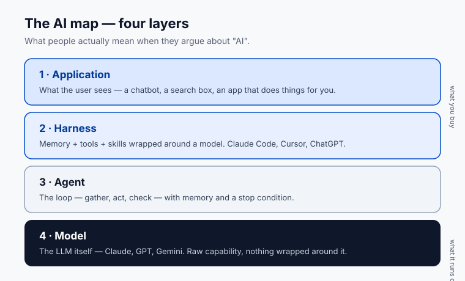

# Lesson 1.1 · The AI map: four layers on one page

**Where this gets you:** you'll be able to put the right layer name on any AI conversation you walk into, so you stop arguing about the wrong thing.

## The idea

Most confusing AI conversations are just one layer being mistaken for another. There are four. Name the right one and most of the noise drops away.

From the top down:

1. **Application.** What the user sees. A chatbot. A search box that uses RAG. An app that goes off and does things for the user. Most product talk lives here.
2. **Harness.** Memory, skills, and tools wrapped around a model. Claude Code, ChatGPT, Cursor, Codex CLI. This is where switching cost lives. Lesson 6.1 goes deep.
3. **Agent.** The loop: gather, act, check, decide whether to keep going — with memory across steps and a stop condition. Lesson 1.3 goes deep.
4. **Model.** The LLM itself. Claude, GPT, Gemini, Gemma, Qwen, DeepSeek. Lesson 1.2 and Lesson 1.5 go here.

Why keep them separate? Because the same word points at different layers. "Claude is better than GPT" is about the **model**. "Cursor is better than Claude Code" is about the **harness**. "Your agent needs better memory" is the **agent and harness** together. If everyone's pointing at a different layer, the argument goes nowhere.

**A real one you'll hear:** a customer says *"we need a better LLM."* Nine times out of ten the LLM is fine — what they actually need is a better harness: better memory, better tools, better evals. Swapping the model costs them a migration and fixes nothing; adding a retrieval step fixes it in an afternoon. Naming the layer is what tells you which. That one distinction saves a quarter of every meeting.

## Your exercise

Pick a product you use every day. ChatGPT, Cursor, Notion AI, GitHub Copilot, something you built. Write one sentence at each of the four layers, naming the choice that product made at that layer.

**You're done when** you have four sentences and they don't blur into each other. Each one is about a different thing.

**Practice proof:** save it in `NOTES.md` under "AI map." You'll reuse this exact frame in Lesson 6.1.

**Build on it:** build a one-page "layer triage" web form where you paste an AI complaint and it asks three questions, then names the layer to fix.

## Why this matters

Every confusing conversation you'll have for the next year as an FDE will dissolve the moment you put the right layer on it. This is the first tool you'll reach for in customer meetings, on Twitter, in your own debugging. Get the layer right and the rest of the conversation becomes easy.

## Open up the world

A few sources that map this territory better than any single course can. Read them as you go, not all at once.

- [Anthropic, Building Effective Agents](https://www.anthropic.com/research/building-effective-agents). The clearest writeup of agent patterns (the agent and harness layers). Start here.
- [Anthropic, Writing tools for agents](https://www.anthropic.com/engineering/writing-tools-for-agents). How to give agents tools they can actually use. The "Act" step of the loop, done right.
- [Andrej Karpathy on YouTube](https://www.youtube.com/@AndrejKarpathy). His "Intro to Large Language Models" is the best hour you can spend on the model layer.
- [Simon Willison's weblog](https://simonwillison.net/). The most useful running commentary on what's actually shipping in this space, updated almost daily.
- [Garry Tan's gbrain](https://github.com/garrytan/gbrain). An opinionated, open-source memory layer for agents. The harness layer made concrete.

You do not need to read all of these before Lesson 1.2. Bookmark them. Come back when a layer gets interesting.

---

Next: [Lesson 1.2 · LLMs: just enough to be dangerous](00b-llms-just-enough.html)
