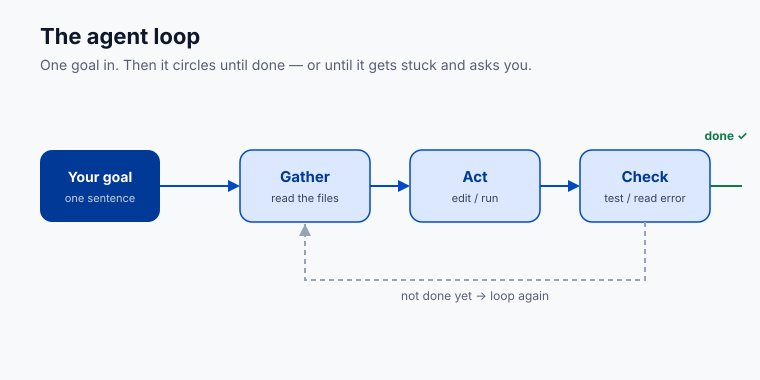
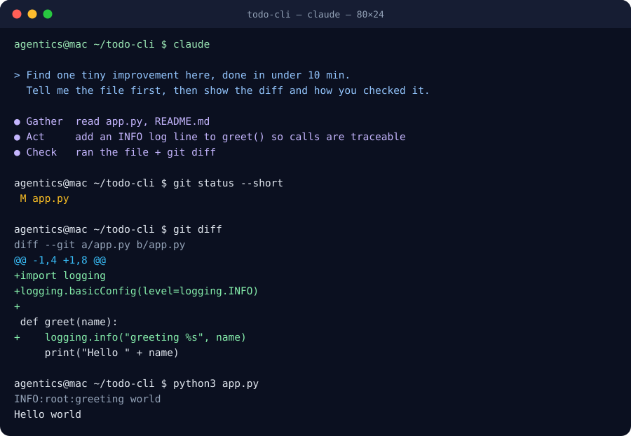

# Lesson 2.3 · Your first session

**Where this gets you:** you'll take one small task end-to-end with an agent and understand the loop it runs (the thing every later lesson builds on).

## The idea

An agent session is a loop, not one prompt and one answer.

You give it a goal. Then it circles: **gather** the files it needs, **act** by making an edit or running a command, **check** what happened by running the test or reading the error. Then it loops — gather, act, check — until the goal is met or it gets stuck and asks you.



You watch this happen in your terminal. It tells you what it read, what it will change, and what each command printed. Read that stream — it's where you catch wrong turns early.

Here's a real one. You ask an agent to "add an INFO log line to `greet()` so calls are traceable." It reads the file (gather), adds the import and the log line (act), then runs the file and shows you the diff (check). You read the diff and sign off. That whole session looks like this:



*The last three commands are yours: `git status --short`, `git diff`, then run it. That's you doing the "check" by hand, on top of the agent's.*

When it heads the wrong way, hit **Esc** and correct it in plain words: "the config lives in `settings/`, not the root" or "skip tests for now, just make the change." It picks up from there with the new information.

**Small asks beat one giant prompt.** "Rename this function and update its callers" gives the agent a clear target. "Refactor the whole module" gives it room to wander. Scope down; ask for the next piece after you've reviewed the last one.

## Do it

Open a repo you know and start your tool:

```bash
claude
```

Codex CLI users run `codex`. Gemini CLI users run `gemini`. Coco users open the approved workspace for the repo or data product.

Pick something genuinely small. A typo in a string, a renamed variable, one new log line.

Give it the goal in one sentence. Then watch. Don't touch anything. Read each step as it scrolls by. What file it opened, what it changed, what it ran.

Here is a safe first-session prompt:

```text
Find one tiny improvement in this repo that can be completed in under ten minutes.
Before editing, tell me the exact file you plan to touch and why.
After editing, show me the diff and the command or manual check you used.
```

If it heads somewhere wrong, hit **Esc** and type what you meant. Let it finish.

## Your exercise

In a repo you know well, give the agent one small, real task. Something you could have done yourself in a few minutes.

Watch the whole loop run without jumping in unless it goes wrong. When it's done, read **every change it made**. Open the diff, read each line, make sure you'd have signed off on it yourself.

Use these commands after the agent finishes:

```bash
# see every changed file
git status --short

# read the actual patch before accepting it
git diff

# run the smallest relevant check for your project
npm test
# or
pytest
# or
make test
```

**You're done when** you've taken one small task end-to-end and can describe the gather → act → check loop in your own words.

**Practice proof:** save the prompt you gave, the diff it produced, and the command or manual check you used to verify it. Fresh graduates should ask a human or teammate to review this first diff if possible.

## Why this matters

Everything later in this course is this loop, scaled up. Bigger tasks, more of them, several at once. If the loop is clear to you on something small, the hard stuff later is just more of a thing you already understand. If it's a blur now, it stays a blur.

---

Previous: [Lesson 2.2 · Install your tool](02-install-your-tool.html) · Next: [Lesson 2.4 · Staying in control](04-staying-in-control.html)
