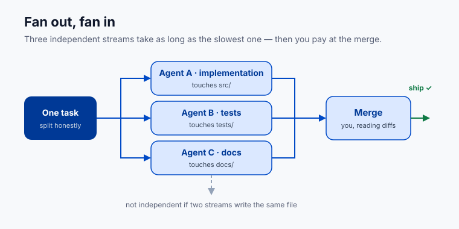

# Lesson 5.1 · Orchestration: parallel agents

**Where this gets you:** you'll take a multi-part task, run its independent pieces as parallel agents instead of one serial chain, and see where the real difficulty moves.

## The idea

Once your briefs, evals, and context are solid, the bottleneck moves. It's no longer how fast one agent writes code. It's how many streams you can keep coherent.

When a task splits into independent pieces, run them side by side. Three independent things take as long as the slowest one, not the sum. Call it **fan-out, fan-in**: split the task, run the pieces, stitch the results together.

Subagents do the same for messy side work. Send one off to "find every place we call the old API." It burns through a pile of reading, comes back with a short answer, and your main session never gets clogged with the noise.

But parallelism only works once each stream is reliable, and once the pieces are *actually* independent.

**Here's how that goes wrong.** You hand Agent A "rename the config key" and Agent B "write tests for the new config." Both come back green. Both edited `config.py`. Neither saw the other's edit, so the merge kept one and silently dropped the other — your suite now passes against a key nothing reads. A bad split costs more than the serial run would have.

## Do it

Take a multi-part task on your project. Ask first: which pieces are *genuinely* independent? Only if neither needs the other's output, and neither writes the other's files. If piece B reads a file piece A creates, that's not parallel. It's a chain.

Parallel doesn't have to mean two different products. It can be:

| Stream A | Stream B |
|---|---|
| Implementation | Tests |
| Frontend copy/layout | Backend/API change |
| Bug investigation | Documentation update |
| Data validation | UI polish |

Then launch them together. In Claude Code, describe the parts and ask it to run them as parallel agents, or hand discrete chunks to subagents. Launch in one go — don't babysit one before starting the next.

## Your exercise

Find a multi-part task on your project. A few unrelated bug fixes. Three small features. A refactor plus its tests and docs.

Split it honestly. Run the pieces as parallel agents or subagents. Then watch what's hard. It won't be speed. It'll be coherence: keeping two agents off the same file, keeping their briefs from contradicting, making the merged result hang together.

**You're done when** you've run at least two genuinely independent pieces of one task in parallel, and can name the part that was hard to keep coherent.

**Practice proof:** write the two stream names, their owners/sessions, their files, and the merge order.

**Build on it:** build a CLI that takes a task list, launches one agent per item in separate git worktrees, and prints which files two streams both touched.

## Why this matters

Speed was never the skill. Any agent is fast. The skill is holding three streams in your head, giving each a clean brief, and stitching the results into one thing that works. That's the difference between using an agent and running a small fleet of them.

---

Previous: [Lesson 4.5 · Design discipline](13-design-discipline.html) · Next: [Lesson 5.2 · Review gates and shipping](15-review-gates-and-shipping.html)
