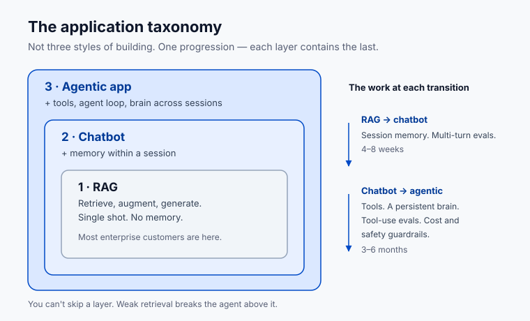

# Lesson 6.2 · The application taxonomy

**Where this gets you:** you'll be able to classify any AI product in the wild onto a three-layer progression in 30 seconds, and you'll know what the next layer of work would look like for any customer engagement.

## The idea

RAG, chatbots, and agentic apps aren't three styles of building. They're a progression. Each layer contains the one before it. Where a project sits tells you what to build next.

**Layer 1: RAG.** Retrieve documents from a corpus, augment the prompt with the chunks you got back, generate an answer. Single-shot. No memory of the last turn. Internal knowledge Q&A, support search, semantic doc lookup. Most "AI search" products in market are still here.

**Layer 2: Chatbot.** Add memory within a session. The model remembers what you said three turns ago. Usually nothing carries across sessions. ChatGPT in consumer mode, support bots, conversational research assistants. The retrieval is still in there; the session memory is what's new.

**Layer 3: Agentic app.** Add tools and the agent loop. The model doesn't just answer, it acts. Reads files, writes files, calls APIs, decides, and persists state across sessions through a brain. Claude Code, Cursor, and most of what serious customer engagements are heading toward.

You can't skip a layer. Go straight to agentic and the retrieval underneath will be flaky. Skip session memory and users will quit re-explaining themselves.

**A real one you'll hear:** a customer says *"we want agents."* You open their repo. It's a vector store, a prompt template, one API call. Every question starts from zero — ask a follow-up and it has no idea what you just asked. That's a Layer 1 system, and they've been calling it "our chatbot" in every board deck for a year. If you nod and start scoping tools and MCP servers, you'll spend three months building an agent on top of retrieval nobody ever evaluated. The right answer is eight weeks of session memory and multi-turn evals first — and it's a much easier sell, because it's the thing their users are already complaining about.

Most enterprise customers have a RAG. They call it "our AI," they want it to do more, and the wedge for a Forward Deployed Engineer is moving them up the stack without breaking the unit economics they already understand.

The work at each transition:

- **RAG to chatbot.** Add session memory. Build a conversational UI on top of the existing retrieval. Write evals for multi-turn coherence. Almost always a 4-8 week engagement.
- **Chatbot to agentic.** Add tools (MCP servers or direct API integrations). Add a persistent brain that lives across sessions. Add evals for tool use, not just answer quality. Add guardrails for cost and safety. Usually a 3-6 month engagement, sometimes a year.

Knowing the gap between where they are and where they think they are is your scoping move.

## Your exercise

Classify your project candidate onto the three layers. Then write two short paragraphs: what the next-layer version of it looks like, and what the work to get there would actually be.

**You're done when** you can classify any AI product you see in the wild onto this taxonomy in under 30 seconds.

**Practice proof:** save your classification and the next-layer write-up in `NOTES.md` under "application taxonomy."

**Build on it:** build a Layer 1 RAG over your own `NOTES.md` — one embedding index, one retrieve-and-answer script — then add session memory and watch it become Layer 2.

## Why this matters

Customers don't know what layer they're on. That's what makes scoping hard — they describe what they want using the words of a layer they haven't reached. Your value as an FDE starts with naming the layers cleanly, then drawing the bridge from where they are to where they want to be, with a real cost and a real timeline on every segment.

---

Next: [Lesson 6.3 · Coordinating with agents and humans](19-coordinating-team.html)
