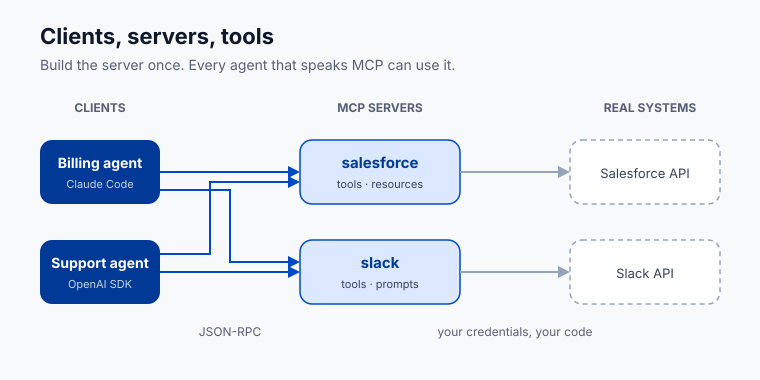

# Lesson 7.3 · Tool protocols: MCP and connectors

**Where this gets you:** you'll know what the Model Context Protocol is and why it exists, you'll connect an agent to a real tool through it, and you'll be able to say how each major platform handles tool connectivity.

## The idea

Every agent needs to reach outside itself: query a database, call an internal API, read a file, post to Slack, look something up in a CRM. The obvious move is to write each integration by hand -- one Python function per tool, hardcoded into the agent. That's fine for one agent with three tools. At ten agents with thirty tools it collapses: every agent reimplements the same integrations, and every API change means touching all of them.

The **Model Context Protocol** (MCP) is the open standard that fixes this. Anthropic published the spec and open-sourced it in late 2024. OpenAI adopted it in early 2025. Google and others followed. It's now the closest thing the ecosystem has to a universal tool connector.

**What MCP actually is.** It's a protocol between two processes: a **client** (the agent, or the host running it) and a **server** (the process exposing tools, data, or prompts). The client asks the server what tools it has, calls them over JSON-RPC, and gets results back. The server can be a local subprocess or a remote HTTP endpoint. The agent never knows how a tool is implemented. It calls it by name with the declared parameters.

Think of it as USB for agent tools. Before USB, every peripheral needed its own driver and connector. After, you plug it in and it works.



**A server can expose three things:**

- **Tools** -- functions the model can call. Same idea as function calling in the raw API, but decoupled from the agent code.
- **Resources** -- files, database rows, or documents the model can read, surfaced as context rather than function calls.
- **Prompts** -- reusable prompt templates the model invokes by name.

Most real servers just expose tools. Resources earn their keep in document-heavy workflows.

**Building a minimal MCP server.** The `mcp` Python SDK from Anthropic is the reference implementation. A server is a small Python file:

```python
from mcp.server.fastmcp import FastMCP

mcp = FastMCP("invoice-tools")

@mcp.tool()
def lookup_invoice(invoice_id: str) -> dict:
    """Return status and amount for the given invoice ID."""
    # your real implementation here
    return {"invoice_id": invoice_id, "status": "paid", "amount": 1200.00}

if __name__ == "__main__":
    mcp.run()
```

That's the whole server. `FastMCP` handles the protocol, the capability negotiation, and the transport. Your job is the tool functions.

To connect Claude Code to it, add it to your `.claude/settings.json`:

```json
{
  "mcpServers": {
    "invoice-tools": {
      "command": "python",
      "args": ["path/to/invoice_server.py"]
    }
  }
}
```

Now every Claude Code session in that project has `lookup_invoice` as a tool. You didn't touch the agent code.

**Using MCP from a programmatic agent.** The Anthropic SDK calls MCP servers directly:

```python
# abbreviated -- check current anthropic docs for the exact async client usage
async with client.beta.messages.with_mcp_server(...) as session:
    # tools from the MCP server are automatically available in messages.create
    ...
```

The OpenAI Agents SDK has native MCP support too:

```python
from agents.mcp import MCPServer, MCPServerStdio

server = MCPServerStdio(params={"command": "python", "args": ["invoice_server.py"]})
agent = Agent(name="BillingAgent", mcp_servers=[server], ...)
```

Same pattern either way: declare the server, and the SDK handles discovery and routing.

**How the platforms handle this.**

| Platform | MCP support | Notes |
|---|---|---|
| Claude Code / Anthropic SDK | Native, first-class | Originated the spec; `mcp` SDK is the reference implementation |
| OpenAI Agents SDK | Adopted MCP in 2025 | `MCPServer` class, works with any MCP-compliant server |
| Gemini / Google ADK | MCP-compatible tooling via Extensions | Check current ADK docs; the ecosystem is moving fast |
| Snowflake Cortex | External functions + partner connectors | No native MCP client at the time of writing; tools are wired as SQL external functions or Python UDFs |

For Snowflake, wrap your tools in an MCP server and call it from a Python layer that also calls Cortex. The Cortex SQL layer stays clean; the MCP server handles the integrations.

**Why a protocol beats bespoke integrations.** Here's the version you'll actually live through. An FDE ships six agents for a customer over a year -- a billing agent, a support triage agent, four others -- each with a Salesforce lookup written inline. Then Salesforce retires the API version they all call. Now it's six repos, six pull requests, six review cycles, six deploys, and the one nobody remembered to patch fails silently in production for a week.

Same customer, MCP: the six agents are clients of one `salesforce` server. You patch it once. Six agents get the fix at the next restart. Composition falls out for free -- an agent that needs Slack and Salesforce connects to both servers and you write no new code.

Pre-built servers are multiplying fast (Anthropic's MCP server directory, plus community registries). Check whether one already exists before you write your own.

**Sharp edges.** MCP servers are processes. They crash, time out, and return malformed responses. Handle `tool_result` errors: log them, retry when it makes sense, and surface a real error message instead of failing silently. And watch your secrets. A server that talks to an external service needs credentials -- keep them in environment variables, never in the server file, and document which ones are required.

## Your exercise

Connect your project's agent to one real tool or data source through MCP. Pick by appetite:

1. **Use an existing MCP server.** Find one already written for a tool you need (GitHub, Slack, a database), add it to your Claude Code config, and get it working in a session.
2. **Build a minimal MCP server.** Write a `FastMCP` server with one or two tools your project actually needs -- a DB lookup, a file reader, a metrics query. Connect it to Claude Code and run a real task through it.
3. **Wire it to a programmatic agent.** Take the agent from Lesson 7.2 and replace one inline tool function with an MCP server call.

**You're done when** an agent in your project calls at least one tool through an MCP server and returns a real result.

**Practice proof:** save a screenshot or terminal output of the tool call in action in `NOTES.md` under "MCP integration," and note which server you used or built.

**Build on it:** add a second tool to your server, then have one agent task call both in a single turn.

## Why this matters

MCP changes the scoping conversation with enterprise customers. "We'll build a custom integration for each system" becomes "we'll build one MCP server per system and every agent shares them." That's a different project shape. One scales; one doesn't.

Customers on Anthropic are already running MCP. OpenAI customers increasingly are too. Building, debugging, and connecting MCP servers is a baseline agentic engineering skill in 2026, not a specialization.

Because the protocol is open, the work is durable. A Salesforce MCP server you build for a Claude deployment today runs against OpenAI and Gemini tomorrow. In a multi-vendor enterprise, that's the whole story.

---

Previous: [Lesson 7.2 · Programmatic agents (the SDKs)](29-programmatic-agents-sdks.html)
